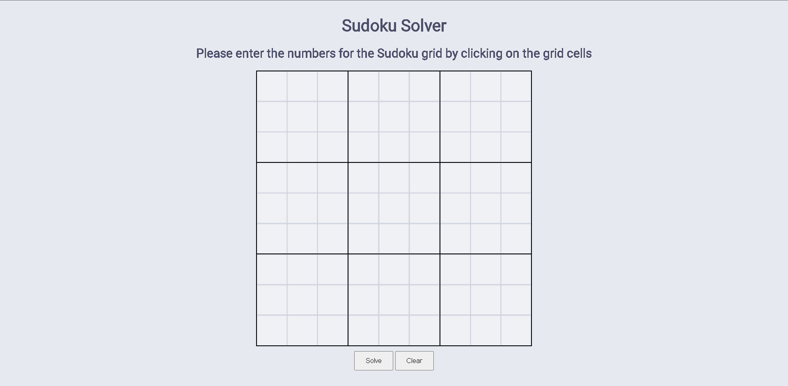
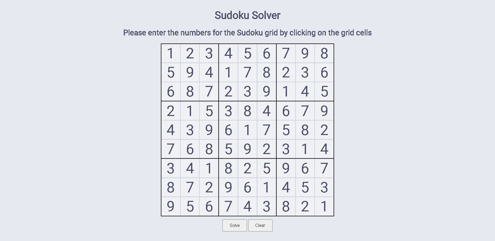

# SUDOKU-SOLVER

The provided HTML code represents a basic Sudoku Solver web application. The solver uses a backtracking algorithm to find a valid solution to the given Sudoku puzzle. Before delving into the backtracking algorithm, let's understand the structure of the HTML and how it interacts with the JavaScript code.

HTML Structure:

The main container consists of a title, an instruction, a table representing the Sudoku grid, and two buttons for solving and clearing the grid.
The Sudoku grid is represented as a 9x9 table, where each cell is a 
 element with the class "grid_elem." Clicking on a cell triggers the display of a row of digits (1 to 9) in a popup just above the cell.
The popup with digits is hidden by default but appears when clicking on an empty cell, allowing the user to select a digit to fill in the cell.
The JavaScript code handles the interaction with the grid, digit selection, and the backtracking Sudoku solver.
Now, let's discuss the backtracking algorithm used to solve the Sudoku puzzle:

solveSudoku(): This function is called when the user clicks the "Solve" button. It starts the process of solving the Sudoku puzzle.

It first reads the current state of the Sudoku grid from the HTML table and stores it in a 2D array called grid.
It then calls the solveSudokuGrid(grid) function with the current grid as an argument.
solveSudokuGrid(grid): This is the main recursive backtracking function that tries to solve the Sudoku puzzle.

It first checks if the given grid is a valid Sudoku grid using the isValidGrid(grid) function. This function checks if the grid is a 9x9 array, contains only numbers from 1 to 9 or 0 for empty cells, and has no duplicate numbers in rows, columns, or 3x3 sub-grids.
If the grid is not valid, the function returns false, indicating that the puzzle cannot be solved.
If the grid is valid, the function checks if the puzzle is already solved by calling the isSolved(grid) function. If it is, the function returns the solved grid.
If the puzzle is not solved, the function searches for an empty cell (cell with value 0) using the findEmptyCell(grid) function. If no empty cell is found, it means the puzzle cannot be solved, and the function returns false.
If an empty cell is found, the function tries to place a number from 1 to 9 in that cell and checks if it is a valid move using the isValidMove(grid, row, col, num) function. The num variable iterates from 1 to 9.
If placing the number is a valid move, the function updates the grid with that number and makes a recursive call to solveSudokuGrid(grid).
If the recursive call returns a solved grid (i.e., not false), the function returns the solved grid to its caller.
If the recursive call returns false, it means the current number placement is invalid, so the function backtracks by resetting the cell to 0 and continues with the next number (backtracking step).
The function keeps trying different numbers in the empty cell until it finds a valid solution or exhausts all possibilities. If no valid solution is found, it returns false.
isValidMove(grid, row, col, num): This function checks whether placing num in the cell at position (row, col) is a valid move or not.

It checks if num already exists in the same row, column, or 3x3 sub-grid. If num already exists in any of these three places, the move is invalid, and the function returns false.
If num does not exist in the row, column, or sub-grid, the move is valid, and the function returns true.
Other Helper Functions:

isValidGrid(grid): Checks if the provided grid is a valid Sudoku grid with no duplicate numbers in rows, columns, or sub-grids.
isValidSet(arr): Checks if the provided array contains no duplicate numbers except for 0 (empty cells).
getColumn(grid, col): Returns the elements of the specified column from the grid.
getSquare(grid, square): Returns the elements of the specified 3x3 sub-grid from the grid.
isSolved(grid): Checks if the Sudoku puzzle is already solved, i.e., all cells are filled.
findEmptyCell(grid): Finds the first empty cell in the grid and returns its position as an array [row, col].
The JavaScript code interacts with the HTML elements, reads the user's input, solves the Sudoku puzzle using the backtracking algorithm, and displays the solved grid back on the HTML table.
